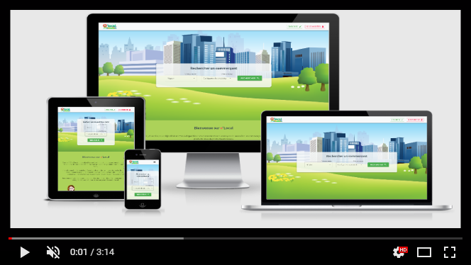

    

# Projet o'Local

      

#### &middot; Live View : https://olocal.go.yj.fr/

#### &middot; Présentation du projet (Vidéo démo Apothéose [O'clock](https://oclock.io/) Atlantis 04/05/2020) :

------------
*o'Local est le fruit de 4 développeurs passionnés qui, dans le cadre de leur projet de fin d'études, ont fait le choix de mettre à profit leurs compétences sur un sujet qui leur tenait à coeur, aux enjeux économiques et aux défis environnementaux actuels.*

---
__Réalisation suivant méthodologie SCRUM :__ 4 sprints du vendredi 03/04/2020 au jeudi 30/04/2020.

## Installation
- [FrontEnd (React)](React/README.md)

- [BackEnd (Symfony)](Symfony/README.md)

## Documentation
 - [x] [Cahier des Charges](https://docs.google.com/document/d/e/2PACX-1vTXsx7UtMEH58hmAPTSzNMw6BrWwMHIXkQII39RdvxkXYw-cpX3JwjNFrOAUVUnlndY45aoAZmixTdK/pub)
 - [x] [Arborescence de l'application](https://drive.google.com/open?id=1mfKCo4-czhFGs5a1QSPVSsrJTw3hOh-N)
 - [x] [Wireframes](https://drive.google.com/open?id=1c-OjwfQCO3-Vbw5DgRaZq7HcQK9SMqr0)
 - [x] [Dictionnaire des données](https://docs.google.com/document/d/e/2PACX-1vSQ-1eLBYbvF2JqJUGhP7U1Q086L1xA1b3P0JzEcfWIaaCDEusXUcatG_F378wDVvbJH0BhOUnuBrif/pub)
 - [x] [Modèle Conceptuel de Données](docs/MCD.svg)
